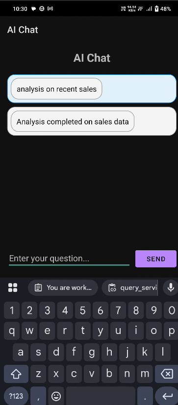
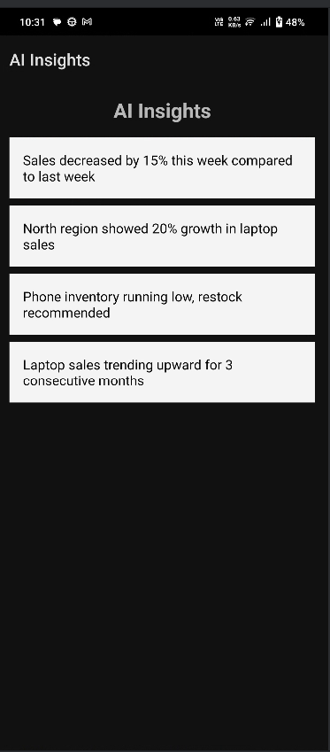
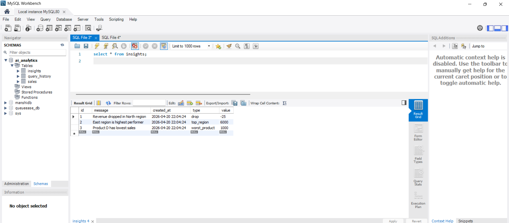
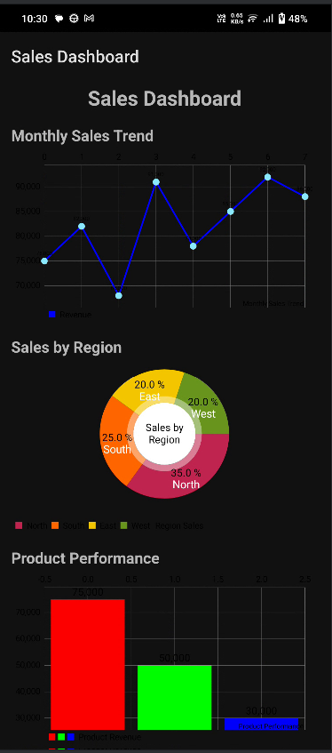
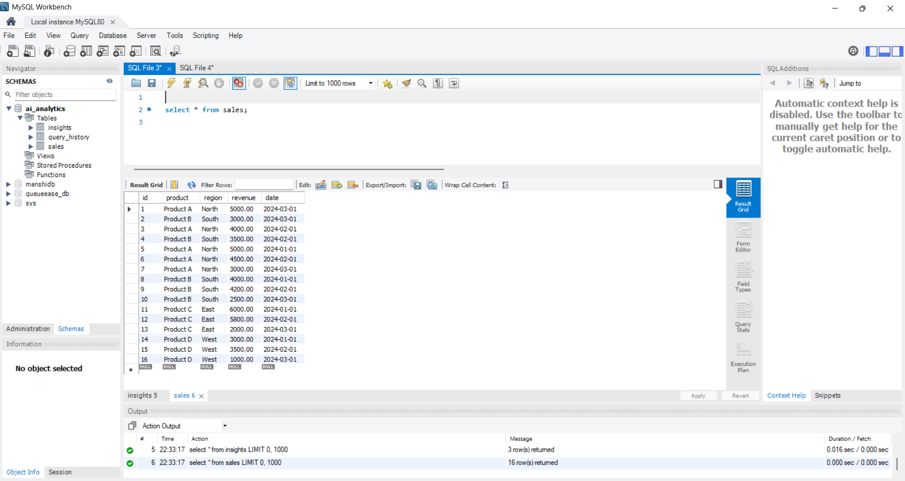

# AI Business Analyst Service

A FastAPI service for natural language to SQL queries with dynamic SQL generation and business analytics.

## Project Structure

```
ai-python-service/
├── main.py                 # FastAPI application and API endpoints
├── requirements.txt        # Python dependencies
├── README.md              # Project documentation
├── sql_generator.py       # Natural language to SQL conversion
├── db_service.py         # Enhanced database operations
├── agents/               # Agent layer
│   ├── __init__.py
│   └── query_agent.py    # AI agent for handling queries
├── services/             # Business logic layer
│   ├── __init__.py
│   └── query_service.py  # Query processing and insights generation
└── db/                   # Database layer
    ├── __init__.py
    └── connection.py     # MySQL database connection
```
## Screenshots








## Features

- **POST /ai/query** endpoint for natural language questions
- **Dynamic SQL generation** from natural language (rule-based, LangChain-ready)
- **Multiple query types supported**:
  - "total sales" → `SELECT SUM(revenue) FROM sales`
  - "top products" → `GROUP BY product ORDER BY revenue DESC`
  - "sales by region" → `GROUP BY region ORDER BY revenue DESC`
  - "average sales" → `SELECT AVG(revenue) FROM sales`
  - "count sales" → `SELECT COUNT(*) FROM sales`
  - "highest/maximum" → `SELECT MAX(revenue) FROM sales`
  - "lowest/minimum" → `SELECT MIN(revenue) FROM sales`
  - "recent sales" → `ORDER BY date DESC LIMIT 10`
- **Dynamic insights generation** based on query results
- **Enhanced response format** with SQL query and results
- MySQL database integration (ai_analytics database)
- Modular architecture with separate layers
- Comprehensive error handling and logging
- SQL query validation for security

## Database Configuration

- **Host**: localhost
- **User**: root
- **Password**: Manshi@263
- **Database**: ai_analytics
- **Table**: sales (with revenue, product, region columns)

## Installation

1. Install dependencies:
```bash
pip install -r requirements.txt
```

2. Ensure MySQL server is running and the `ai_analytics` database exists with a `sales` table.

## Running the Service

```bash
python -m uvicorn main:app --host 0.0.0.0 --port 8000
```

## API Usage

### POST /ai/query

**Request:**
```json
{
  "question": "total sales"
}
```

**Response:**
```json
{
  "answer": "Total sales is 15500.00",
  "insights": [
    "Moderate sales performance - revenue exceeds 10K"
  ],
  "sql_query": "SELECT SUM(revenue) as total_sales FROM sales;",
  "results": [
    {
      "total_sales": "15500.00"
    }
  ]
}
```

**Example Queries:**
- `"total sales"` - Returns sum of all revenue
- `"top products"` - Returns products ranked by revenue
- `"sales by region"` - Returns regional sales breakdown
- `"average sales"` - Returns average revenue
- `"count sales"` - Returns total number of sales records
- `"highest sales"` - Returns maximum revenue value
- `"lowest sales"` - Returns minimum revenue value
- `"recent sales"` - Returns latest 10 sales records

### Other Endpoints

- **GET /** - Root endpoint with service info
- **GET /health** - Health check endpoint

## Architecture

- **Agents Layer**: Handles query orchestration and high-level processing
- **Services Layer**: Contains business logic, insights generation, and query processing
- **SQL Generator**: Converts natural language to SQL queries (rule-based, extensible to LangChain)
- **Database Service**: Enhanced database operations with validation and error handling
- **Database Layer**: Manages MySQL connections and basic queries
- **API Layer**: FastAPI endpoints and request/response handling

## Dynamic Insights

The service automatically generates insights based on:
- Query type and results
- Revenue performance metrics
- Product performance analysis
- Regional sales breakdown
- Numeric column analysis
- Data ranges and averages

## Security Features

- SQL query validation to prevent injection
- Only SELECT statements allowed
- Dangerous keywords blocked (DROP, DELETE, etc.)
- Input sanitization and validation

## Future Enhancements

- LangChain integration for advanced NLP processing
- OpenAI API integration for more sophisticated query understanding
- Additional database support
- Real-time analytics dashboard
- Query history and caching
